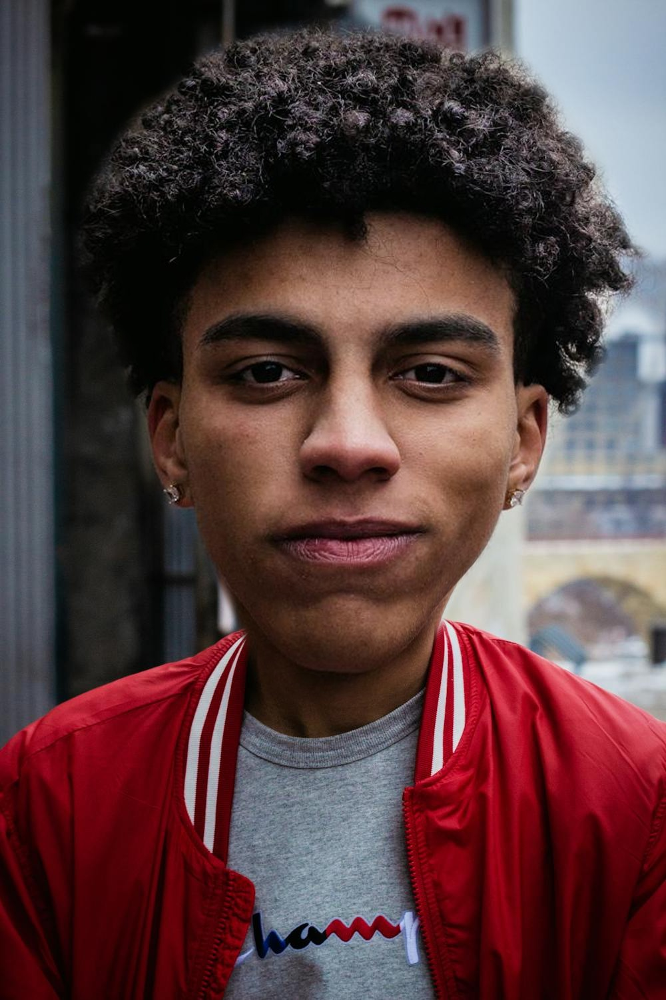

# Bigger Head Dataset

Fine-tuning dataset for head/face enlargement image processing.

## Sample Images

### Example 1

  
  

- **Start**: [1_start.jpg](./1_start.jpg)
- **End**: [1_end.jpg](./1_end.jpg) 
- **Prompt**: [1_end.txt](./1_end.txt)

### Example 2

  
  

- **Start**: [2_start.jpg](./2_start.jpg)
- **End**: [2_end.jpg](./2_end.jpg)
- **Prompt**: [2_end.txt](./2_end.txt)

### Example 3

  
  

- **Start**: [3_start.jpg](./3_start.jpg)
- **End**: [3_end.jpg](./3_end.jpg)
- **Prompt**: [3_end.txt](./3_end.txt)