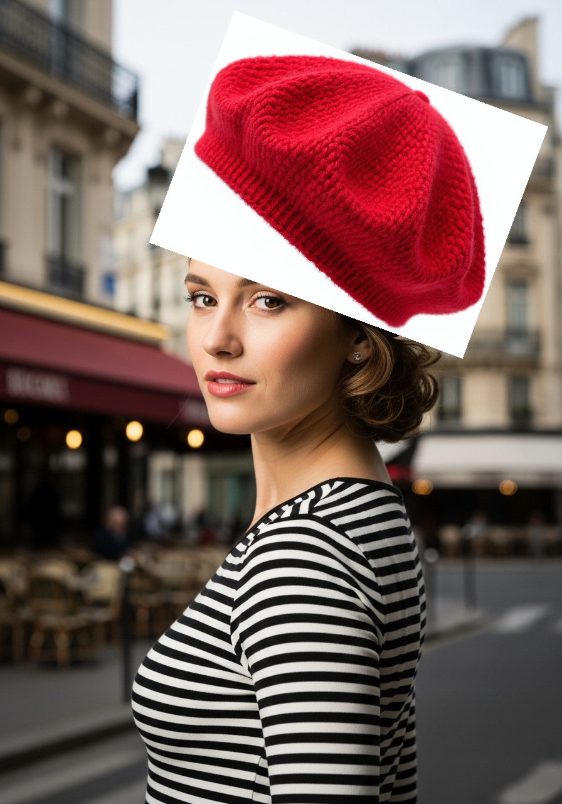

# Hat Overlay Dataset

Fine-tuning dataset for hat addition/overlay image processing.

## Sample Images

### Example 1

  
  

- **Start**: [1_start.png](./1_start.png)
- **End**: [1_end.png](./1_end.png)

### Example 2

  
  

- **Start**: [2_start.png](./2_start.png)
- **End**: [2_end.png](./2_end.png)

### Example 3

  
  

- **Start**: [3_start.png](./3_start.png)
- **End**: [3_end.png](./3_end.png)